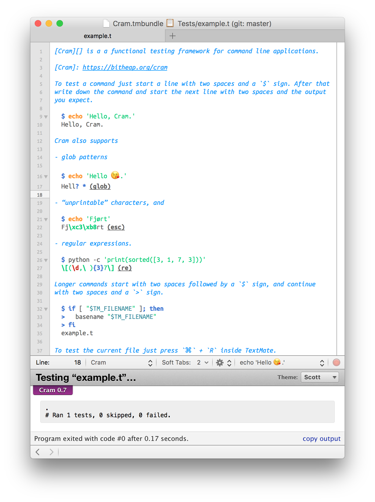

# Cram Bundle

This [TextMate](https://github.com/textmate/textmate) bundle provides support for [Cram](https://bitheap.org/cram), a functional testing framework for command line applications.



# Installation

## Manual

1. Download the latest [release][]
2. Unzip the archive
3. Double-Click on “Cram.tmbundle”

[release]: http://github.com/sanssecours/Cram.tmbundle/releases

## Terminal

```sh
mkdir -p "$HOME/Library/Application Support/Avian/Bundles"
cd "$HOME/Library/Application Support/Avian/Bundles"
git clone https://github.com/sanssecours/Cram.tmbundle
```

# Requirements

- **Operating System:** OS X 10.10.0 or newer
- **TextMate:** 2.0-beta.12.11 or newer
